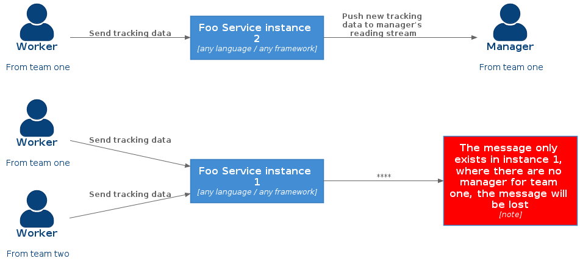

This repo was made to support an article I'm writing (link will be added soon) about how we can scale up applications that rely on persistent connections, based in a real world scenario I faced some years ago.

## The problem

There is a system where there are teams of workers and each team has a manager who wants to see in 'real time', the location of their workers on a map. The refreshing rate of the worker's position must be as short as possible and the system must be able to handle thousands of workers sending tracking data at the same time. There's also another characteristic, the number of workers online is seasonal, it means, there are periods of time where the number of active workers may spike aggressively or be reduced by half of its usual.

To solve this problem, we are goingo to rely on persistent connections, creating data streams betwen the actors of the system (futher information and full discussion about the problem, you can find on the article). But, what is the issue about scalling up services that rely on persistent connections?

When we have more than one instance of the service that will handle with the persistent connections, one of the intentions is to split the work load between the instances, thus, each instance will keep part of the connections from both, Workers and Managers. If the reading stream, from the Manager users, may not be in the same service that holds the Woker's connection, how will it be able to receive the tracking data from their entire team?



## Solutions

Both solutions presented bellow are pretty similar, both broadcast the tracking data between all of the instances, so it doesn't matter if the Manager's connections is in a different instance than the Worker's ones.

This is a solution that works, to a certain extent, but it still have some tradeoffs and bottlenecks that we have discussed in the article. So, this is like a partial solution, we're still going to improve this architecture to a most robust one in the chapter two of this article, stay tuned!

### Redis


### Kafka


## Project structure

* **api-gateway** - edge service for both solutions, it'll route all the requests to kafka and redis solutions;
* **service-discovery** - keeps track of all active microservice instances in the environment;
* **tracking-core** - the core solution of the given problem, this module is used by both scalling strategies;
* **tracking-kafka** - the kafka implementation to scale the application;
* **tracking-redis** - the redis implementation to scale the application;
* **team-simulator** - a Node.js application used to simulate Worker users, we can create teams and simulate the movimentation of its members for both projects, tracking-redis and tracking-kafka;
* **team-tracking-view** - a view application, we will be able to see in action the pretending data created by the **team-simulator** project;

## Running

This project has a `docker-compose` file so you can just run it `docker-compose up`. It will create all the needed containers.

You'll be able to acess the **team-tracking-view** hitting `http://localhost:3000`

### Simulating teams

You can simulate working teams, by running the **team-simulator** project (`npm start` on it's root folder). By default, to save resources, there are only 80 workers for `team_one` on the kafka project, with a delay of 550 between the generated data by a worker. And there is 95 workers for `team_two` on the redis project, with also, a delay of 550 between the generated data by a worker.

You'll be able to alter these values, based on your available resources by changing the following environment variables:

```
KAFKA_WORKERS and REDIS_WORKERS, both refer to the number of workers for `team_one` and `team_two`

KAFKA_UPDATE_DELAY and KAFKA_UPDATE_DELAY, both refer to the delay between the generated data
```

## Notice

This project runs a lot of containers, and in order to prevent your system from running out of resources, the number of replicas for **tracking-redis** and **tracking-kafka** was reduced to one. So, in order to achieve the actual result of this project, change this value to something `>= 2` (in it's docker-copose file) according to your available resources.